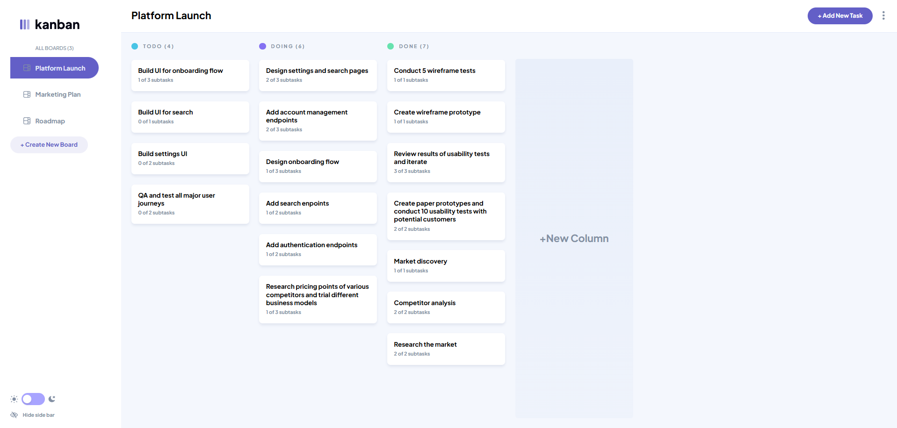
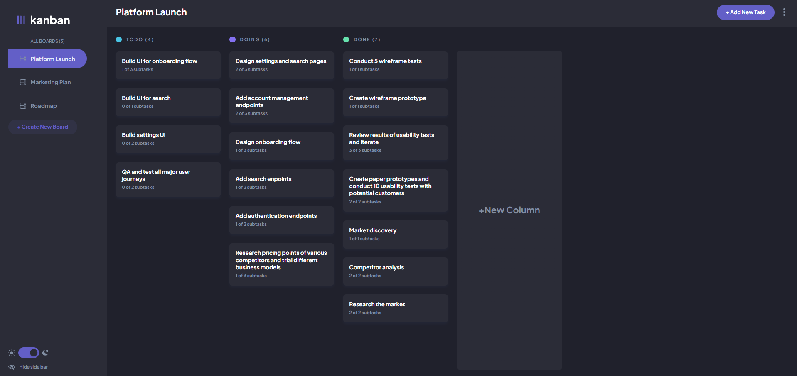
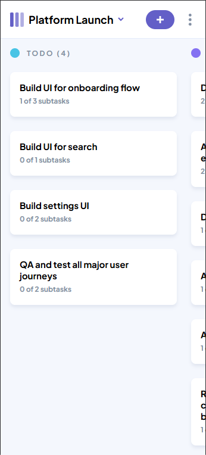

# Kanban Task Management App

A responsive Kanban board application built with React and Redux Toolkit. Users can create, edit, and delete boards, columns, tasks, and subtasks, with support for drag-and-drop task movement, dark mode, and mobile layout.

## Features

- Create, edit, and delete boards
- Add, edit, and delete columns
- Create, edit, and delete tasks
- Add and update subtasks
- Mark subtasks as completed
- Drag and drop tasks between columns
- Light and dark theme
- Responsive desktop and mobile layout
- Empty state when no boards exist
- Local storage persistence

## Built With

- React
- Redux Toolkit
- Tailwind CSS
- Vite
- dnd-kit


## Screenshots

### Desktop Light



### Desktop Dark



### Mobile




## Getting Started

Install dependencies:

```bash
npm install

## Live Demo

[View live project](https://kanban-project-github.netlify.app/)
